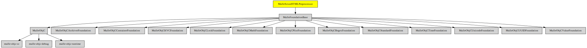

# MulleScionHTMLPreprocessor

#### 🥣 A Preprocessor for HTML that converts `<objc>` and other tags to MulleScion ``


Write your [MulleScion](//github.com/MulleWeb/MulleScion) template code in HTML
lookalike tags. Now reformat the HTML document and it doesn't destroy your
template code (as much).

> Check the [Wiki](//github.com/MulleWeb/MulleScionHTMLPreprocessor/wiki) for editor setup help.

| Release Version                                       | Release Notes
|-------------------------------------------------------|--------------
|  [](//github.com//MulleScionHTMLPreprocessor/actions)| [RELEASENOTES](RELEASENOTES.md) |


## Usage

> Preprocessor support is available starting with MulleScion version 1859.

```
MulleScionParser *parser;

...
[parser setPreprocessor:[MulleScionHTMLPreprocessor object]];
```


## Example

``` html
 <html>
  <head>
    <objc>
       x = @"Hello World";
    </objc>
  </head>
  <body>
    <if x>
       <h1></h1>
    <else/>
       <h1>I have nothing to say</h1>
    </if>
  </body>
</html>
```


## Info

### Hide the uglies in HTML preview

Unknown tags shouldn't get rendered by the browser. Therefore there is nothing to do for
most tags. The text between `<objc>` and `</objc>` can be hidden with CSS:

``` html
<style type="text/css">
 objc { display: none; white-space: pre; }
</style>
```

### Tags

Tag pairs enclose template content. The tag-pairs are translated to MulleScion
handlebars. There is no syntax check done on the text following the tag
identifier.

| Tag Opener          | Closer     | Translates to
|---------------------|------------|-------------------------
| `<block>`           | `</block>` | `` ``
| `<else/>`           |            | ``
| `<if expr>`         | `</if>`    | `` ``
| `<for var in expr>` | `</for>`   | `` ``
| `<objc>`            | `<objc>`   | ``
| `<while expr>`      | `</while>` | `` ``

`objc` is useful to add Objective-C code in the `<head>` section of the HTML
document, but it can be placed anywhere.
The other tags are more useful in the `<body>` section.

> #### Notes
>
> * `<block>` is experimental, it might get removed
> * `<else/>` has no closer.

## Overview


| Requirement                                  | Description
|----------------------------------------------|-----------------------
| [MulleFoundationBase](https://github.com/MulleFoundation/MulleFoundationBase)             | 🛸 MulleFoundationBase does something
| [mulle-objc-list](https://github.com/mulle-objc/mulle-objc-list)             | 📒 Lists mulle-objc runtime information contained in executables.


## Add

Use [mulle-sde](//github.com/mulle-sde) to add MulleScionHTMLPreprocessor to your project:

``` sh
mulle-sde add github:MulleWeb/MulleScionHTMLPreprocessor
```

## Install

### Install with mulle-sde

Use [mulle-sde](//github.com/mulle-sde) to build and install MulleScionHTMLPreprocessor and all dependencies:

``` sh
mulle-sde install --prefix /usr/local \
   https://github.com//MulleScionHTMLPreprocessor/archive/latest.tar.gz
```

### Manual Installation

Install the [requirements](#Overview) and then install
**MulleScionHTMLPreprocessor**
with [cmake](https://cmake.org). Here `/usr/local` is chosen as the install
prefix:

``` sh
cmake -B build \
      -DCMAKE_INSTALL_PREFIX=/usr/local \
      -DCMAKE_PREFIX_PATH=/usr/local \
      -DCMAKE_BUILD_TYPE=Release &&
cmake --build build --config Release &&
cmake --install build --config Release
```

## Platforms and Compilers

All platforms and compilers supported by
[mulle-c11](//github.com/mulle-c/mulle-c11).


## Author

[Nat!](https://mulle-kybernetik.com/weblog) for Mulle kybernetiK

